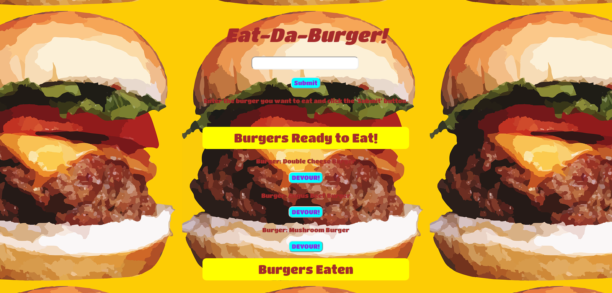
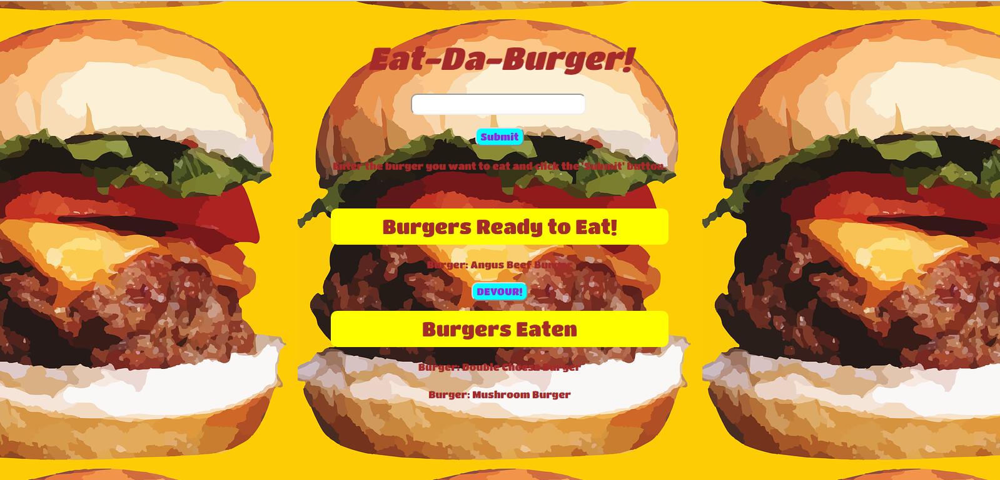
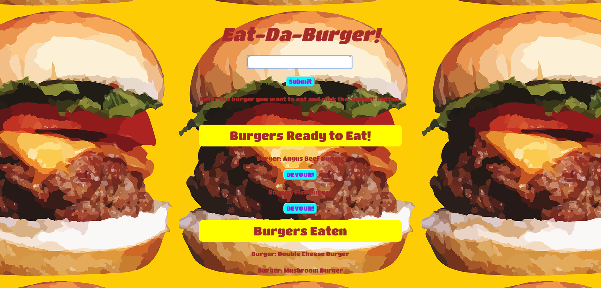

# Eat the Burger!

The goal was to create a Burger App using Node Express Handlebars and our own ORM. It uses the MVC design pattern, Node and MySQL to query and route data to the app and Handlebars to generate the HTML.

## Getting Started

Clone prject to your local machine with ```git clone```

Create database MySQL database with provided schema and seeds

Make sure your local server is live

Run ```node server.js``` in the command line while in the appropriate directory


## Screen Shots
Main Page <br>


When the user clicks Devour it! button, the burger will move to the bottom side of the page <br>


Whenever a user submits a burger's name, the app will display the burger on the middle of the page <br>



## Technologies used

- Node.js
- MySQL
- body-parser NPM Package - https://www.npmjs.com/package/body-parser
- express NPM Package - https://www.npmjs.com/package/express
- mysql NPM Package - https://www.npmjs.com/package/mysql
- express-handlbars NPM Package - https://www.npmjs.com/package/express-handlebars


### Prerequisites

Must install node packages: mysql, express, body-parser...

```
npm i
```
```
- Node.js - Download the latest version of Node https://nodejs.org/en/
- Materialize - Add CDN link http://materializecss.com/getting-started.html
```


